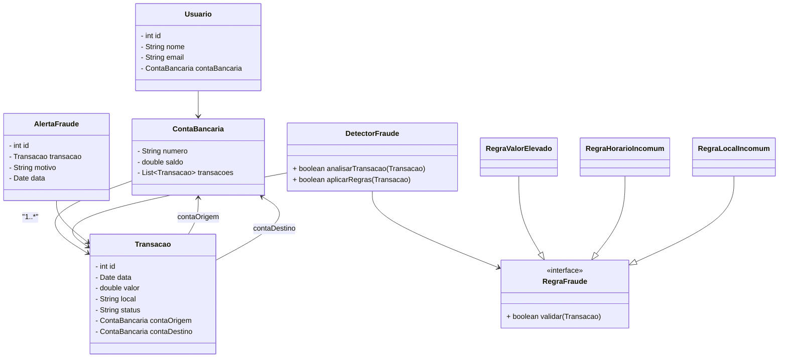

```mermaid
classDiagram
  class Usuario {
    - int id
    - String nome
    - String email
    - ContaBancaria contaBancaria
  }

  class ContaBancaria {
    - String numero
    - double saldo
    - List~Transacao~ transacoes
  }

  class Transacao {
    - int id
    - Date data
    - double valor
    - String local
    - String status
    - ContaBancaria contaOrigem
    - ContaBancaria contaDestino
  }

  class DetectorFraude {
    + boolean analisarTransacao(Transacao)
    + boolean aplicarRegras(Transacao)
  }

  class RegraFraude {
    <<interface>>
    + boolean validar(Transacao)
  }

  class RegraValorElevado
  class RegraHorarioIncomum
  class RegraLocalIncomum

  class AlertaFraude {
    - int id
    - Transacao transacao
    - String motivo
    - Date data
  }

  Usuario --> ContaBancaria
  ContaBancaria --> Transacao : "1..*"
  Transacao --> ContaBancaria : contaOrigem
  Transacao --> ContaBancaria : contaDestino
  DetectorFraude --> RegraFraude
  RegraValorElevado --|> RegraFraude
  RegraHorarioIncomum --|> RegraFraude
  RegraLocalIncomum --|> RegraFraude
  DetectorFraude --> Transacao
  AlertaFraude --> Transacao
```